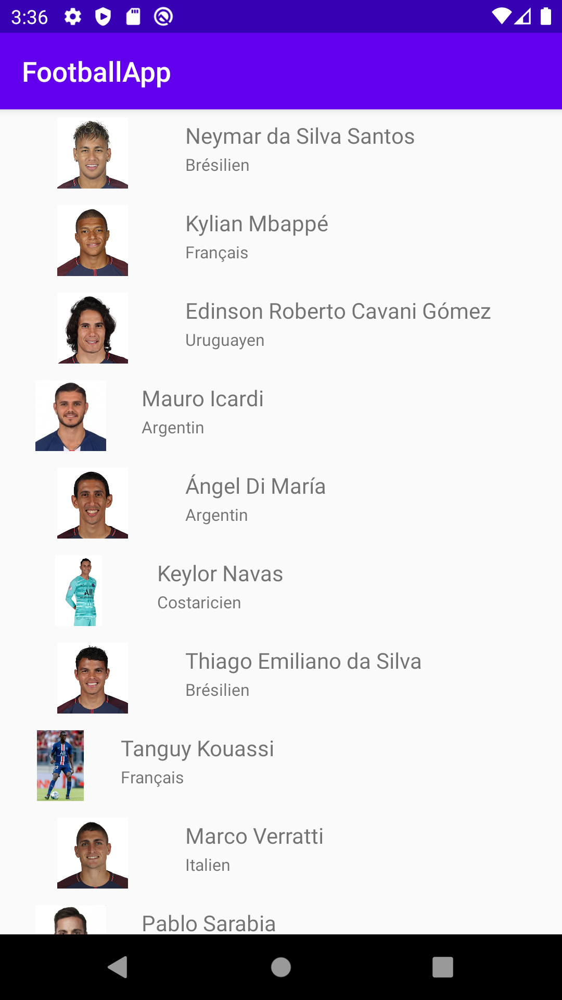
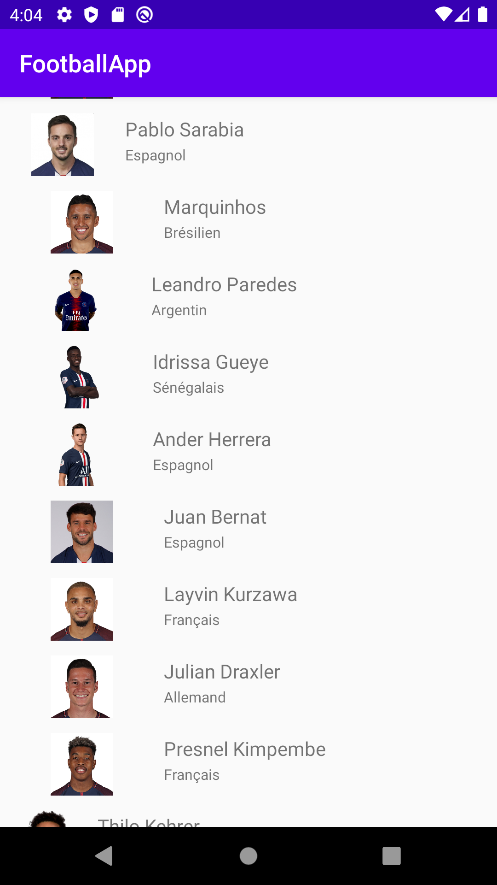
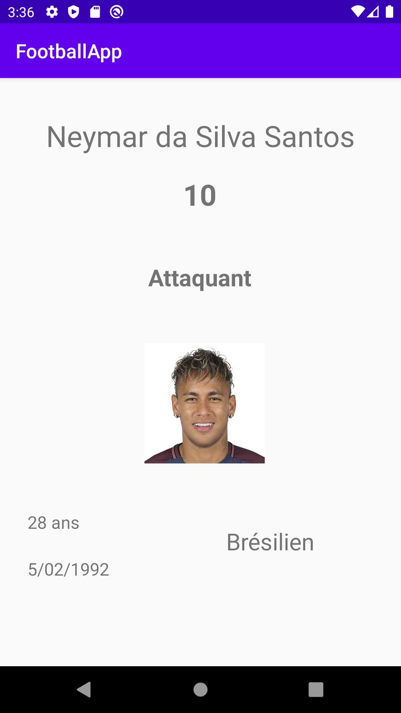
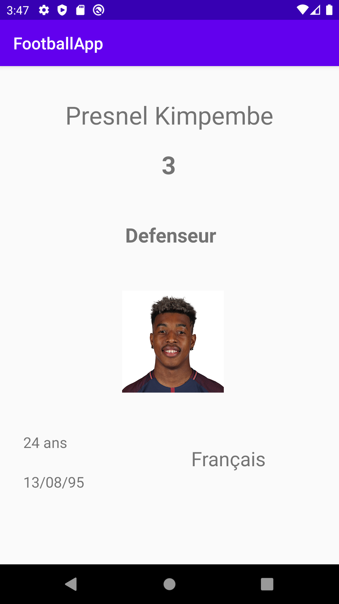

# Application FootballApp


## Présentation

Simple projet démontrant l'utilisation d'une application android codé en Java.

Cette application affiche la liste de l'effectif du PSG et utilise l'API de Github permettant d'aller chercher un fichier sur le repo d'un utilisateur Github.

## Prérequis


- Installation d'Android Studio<br/>


````
https://github.com/rayanecher/FootballApp
````

## Consignes respectées : 
          
- Appel à une API REST
- 2 écrans( liste d'éléments, détail d'un élément) 
- Stockage de données en cache 


Fonctions supplémentaires :

- Création API REST
- Architecture : 
                 - Singleton
                 - MVC
                 - SOLID
- Design


## Fonctionnalités: 

### Premier écran 

- Affiche la liste des joueurs du PSG.
- Image, nom du joueur sont clicables. 

 


### Écran du détail d'un joueur

- Affiche les différentes informations du joueur (nom, numéros de maillot, photo, nationalité, âge, date de naissance).

  


